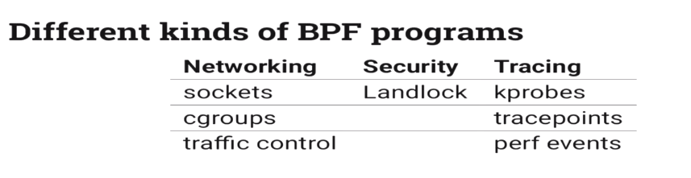

# bpf-notes

Traditionally, BPF could only be attached to sockets for socket filtering. BPF's first use case was in `tcpdump`. When you run `tcpdump` the filter is compiled into a BPF program and attached to a raw `AF_PACKET` socket in order to print out filtered packets. But over the years, eBPF added the ability to attach to [other kernel objects](https://github.com/torvalds/linux/blob/v4.14/include/uapi/linux/bpf.h#L117-L133). In addition to socket filtering, some supported attach points are:

*   Kprobes (and userspace equivalents uprobes)
*   Tracepoints
*   Network schedulers or qdiscs for classification or action (tc)
*   XDP (eXpress Data Path) This and other, newer features like in-kernel helper functions and shared data-structures (maps) that can be used to communicate with user space, extend BPF's capabilities.

**Summary Presentation**: - [Toward Flexible and Efficient In-Kernel Network Function Chaining with IOVisor](/papers/18HPSR%20-%20eBPF.pdf)

- [A thorough introduction to eBPF](https://lwn.net/Articles/740157/) 
- [BPF and XDP Reference Guide](https://github.com/cilium/cilium/blob/master/Documentation/bpf.rst)
- eBPF maps: Using eBPF maps is a method to keep state between invocations of the eBPF program, and allows sharing data between eBPF kernel programs, and also between kernel and user-space applications.
  - [eBPF maps](https://prototype-kernel.readthedocs.io/en/latest/bpf/ebpf_maps.html)
  - [Types of eBPF maps](https://prototype-kernel.readthedocs.io/en/latest/bpf/ebpf_maps_types.html)
  - [`bpf_map_get_next_key` pitfalls](https://www.bouncybouncy.net/blog/bpf_map_get_next_key-pitfalls/)
- [Persistent BPF objects](https://lwn.net/Articles/664688/)
- [Using eBPF in Kubernetes](https://kubernetes.io/blog/2017/12/using-ebpf-in-kubernetes/)
- Kernel docs
  - [BPF(2) man page](http://man7.org/linux/man-pages/man2/bpf.2.html)
  - [Linux Socket Filtering aka Berkeley Packet Filter (BPF)](https://github.com/torvalds/linux/blob/master/Documentation/networking/filter.txt)

## Go + eBPF
- https://github.com/iovisor/gobpf
- https://github.com/andrewkroh/go-ebpf
- https://github.com/newtools/ebpf
- comparison: https://github.com/newtools/ebpf/issues/54
- projects on Github: https://github.com/topics/ebpf

## Testing eBPF in CI

- [Video: High-performance Linux monitoring with eBPF](https://www.youtube.com/watch?v=uTTFUpT0Sfw)

## XDP

- [What is XDP?](http://prototype-kernel.readthedocs.io/en/latest/networking/XDP/introduction.html)
- [XDP based load balancer with L3DSR support](https://gist.github.com/summerwind/080750455a396a1b1ba78938b3178f6b)
- [Drop incoming packets on XDP layer and count for which protocol type](https://github.com/iovisor/gobpf/blob/master/examples/bcc/xdp/xdp_drop.go)
- [XDP Production Usage: DDoS Protection and L4LB](https://github.com/tamalsaha/bpf-notes/blob/master/papers/zhou-netdev-xdp-2017.pdf)
- [Network filtering for control groups](https://lwn.net/Articles/698073/)

## L7 in Kernel
- [New approaches to network fast paths](https://lwn.net/Articles/719850/)
- kproxy
  - [Kproxy](https://www.youtube.com/watch?v=CcGtDMm1SJA&feature=youtu.be&t=30m15s)
  - [kproxy: Kernel Proxy](https://lwn.net/Articles/726811/)
- [Perf ring buffer](https://lwn.net/Articles/388978/)
- [TLS in the kernel](https://lwn.net/Articles/666509/)
- [Crypto kernel TLS socket](https://lwn.net/Articles/665602/)
- [PLAYING WITH KERNEL TLS IN LINUX 4.13 AND GO](https://blog.filippo.io/playing-with-kernel-tls-in-linux-4-13-and-go/)

## Reading List
- [Further Reading](https://github.com/cilium/cilium/blob/master/Documentation/bpf.rst#further-reading)
- [Dive into BPF: a list of reading material](https://qmonnet.github.io/whirl-offload/2016/09/01/dive-into-bpf/)
- [How to filter packets super fast: XDP & eBPF!](https://jvns.ca/blog/2017/04/07/xdp-bpf-tutorial/)
- [http://brendangregg.com/perf.html#eBPF](http://brendangregg.com/perf.html#eBPF)

**Notes**
- This also implies that API users must clear/zero sizeof(bpf_attr), as compiler can size-align the struct differently, to avoid garbage data to be interpreted as parameters by future kernels.

## eBPF + Prometheus exporter
- https://github.com/cloudflare/ebpf_exporter
- https://github.com/dswarbrick/ebpf_exporter

## eBPF VM in userspace
- https://github.com/iovisor/ubpf/

## BPF: sockmap and sk redirect support
- John Fastabend: https://lwn.net/Articles/731133/
- Sample problem: https://github.com/linus5/linux-kernel-xdp/commit/f0c18713b4e6d5398fc9cb8b24a61c566ecbd166

This series implements a sockmap and socket redirect helper for BPF
using a model similar to XDP netdev redirect. A sockmap is a BPF map
type that holds references to sock structs. Then with a new sk
redirect bpf helper BPF programs can use the map to redirect skbs
between sockets,

      bpf_sk_redirect_map(map, key, flags)

Finally, we need a call site to attach our BPF logic to do socket
redirects. We added hooks to recv_sock using the existing strparser
infrastructure to do this. The call site is added via the BPF attach
map call. To enable users to use this infrastructure a new BPF program
BPF_PROG_TYPE_SK_SKB is created that allows users to reference sock
details, such as port and ip address fields, to build useful socket
layer program. The sockmap datapath is as follows,

     recv -> strparser -> verdict/action

where this series implements the drop and redirect actions.
Additional, actions can be added as needed.

A sample program is provided to illustrate how a sockmap can
be integrated with cgroups and used to add/delete sockets in
a sockmap. The program is simple but should show many of the
key ideas.

To test this work test_maps in selftests/bpf was leveraged.
We added a set of tests to add sockets and do send/recv ops
on the sockets to ensure correct behavior. Additionally, the
selftests tests a series of negative test cases. We can expand
on this in the future.

I also have a basic test program I use with iperf/netperf
clients that could be sent as an additional sample if folks
want this. It needs a bit of cleanup to send to the list and
wasn't included in this series.

For people who prefer git over pulling patches out of their mail
editor I've posted the code here,

https://github.com/jrfastab/linux-kernel-xdp/tree/sockmap

For some background information on the genesis of this work
it might be helpful to review these slides from netconf 2017
by Thomas Graf,

http://vger.kernel.org/netconf2017.html
https://docs.google.com/a/covalent.io/presentation/d/1dwS...

**XDP support for veth driver**
- https://twitter.com/davem_dokebi/status/1021082455086792704
- https://marc.info/?l=linux-netdev&m=153227240330693&w=2

**Accelerating Linux security with eBPF iptables**
- https://twitter.com/sebymiano/status/1027164445448069120?s=19

**eBPF with autocomplete**
- https://ops.tips/blog/developing-ebpf-with-autocompletion-support/

**GRO Engine**
- https://lwn.net/Articles/358910/

